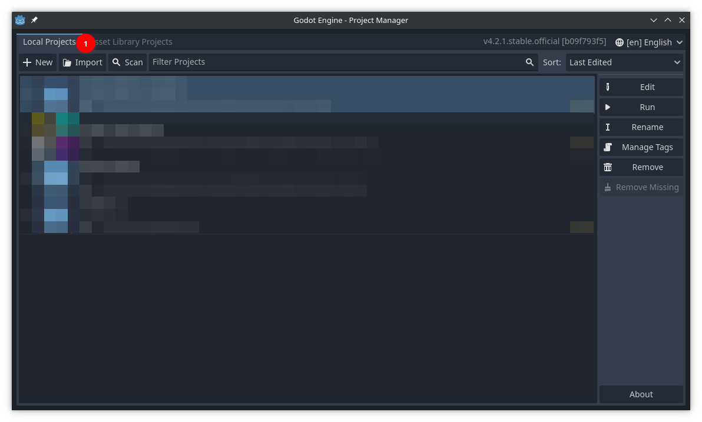
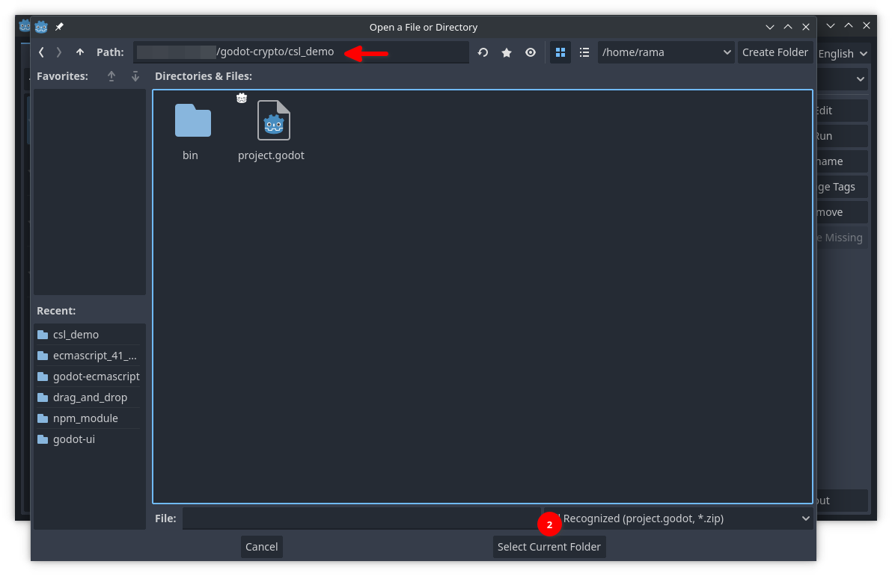
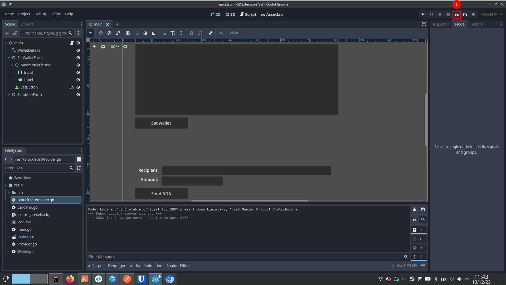
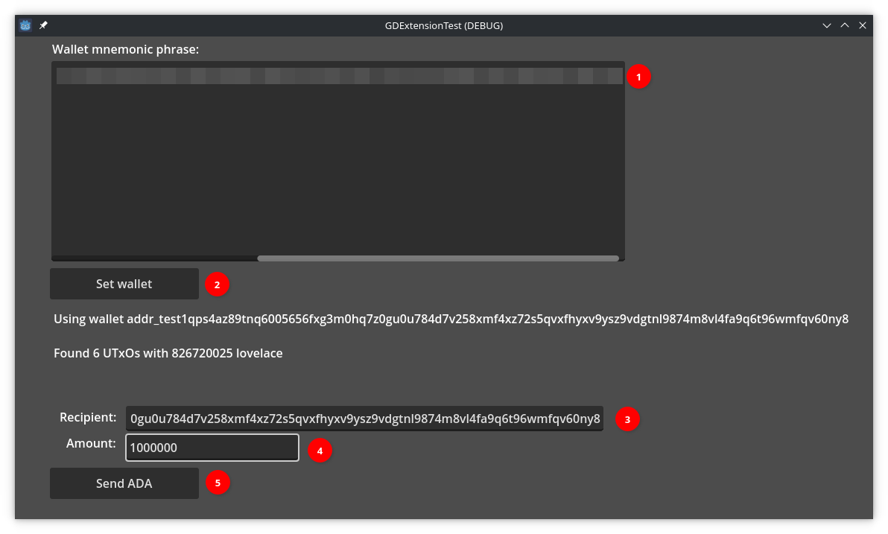
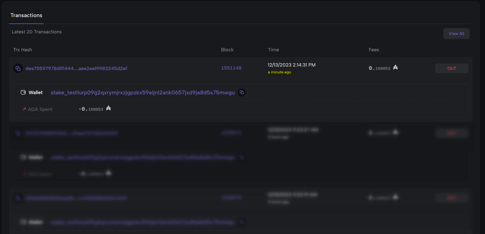

# Cardano Game Engine Wallet - Godot Integration

Cardano Game Engine Wallet is an integrated light wallet *and* off-chain SDK for
the Godot engine and Cardano blockchain. The project is currently a *work-in-progress*.

This project was publicly funded by the Cardano community in round 10 of [Project Catalyst](https://projectcatalyst.io/funds/10/f10-developer-ecosystem-the-evolution/mlabs-cardano-game-engine-wallet-godot-integration). Thank you for your support!

## Status of the project

The project currently consists of a small demo that showcases two features:

* Generating / importing a wallet by entering a seed-phrase
* Transferring ADA to an arbitrary Cardano address.

At the momment, the demo runs on the *preview* testnet and was tested on
*Linux, x86-64 PCs*. Support for others operating systems is coming in the future.

## How to build and run the demo with Godot

### Pre-requisites

* Godot Engine 4.2: The demo runs on version 4.2 of the Godot engine, which you
  can download at the [official website](https://godotengine.org/).

* A wallet with funds in the Cardano preview testnet: You can use any wallet you like, as
  long as it supports the preview testnet. *Take note of the seed-phrase of your wallet*. To get test ADA (tADA), use the [Cardano testnet faucet](https://docs.cardano.org/cardano-testnet/tools/faucet/).

* A Blockfrost token: Our demo uses Blockfrost as a provider for querying the blockchain and submitting transactions.
[You will need a Blockfrost account](https://blockfrost.dev/overview/getting-started#log-in--sign-up) and a *preview testnet token*.

### Setup

First, clone the repository and enter the top directory.

```bash
$ git clone https://github.com/mlabs-haskell/godot-cardano.git
$ cd godot-cardano
```

Download `godot-cardano.zip` from the [releases page](https://github.com/mlabs-haskell/godot-cardano/releases/), unzip it and copy the `addons` folder into the `demo` folder of the repo.

```bash
$ curl https://github.com/mlabs-haskell/godot-cardano/releases/download/release-.../godot-cardano.zip -O godot-cardano.zip
$ unzip godot-cardano.zip -o demo
```

Inside the `demo` folder, create a "preview_token.txt" file with your Blockfrost preview token.

```bash
$ echo "<YOUR TOKEN>" > demo/preview_token.txt
```

Open the Godot editor. You will be greeted by the _Project Manager_. Import and open the project located in the `demo` folder.





You should now have the Godot editor window with the project loaded. Press the button for running the current scene (or press `F5`).



### How the demo works

The demo consists of two forms:

1. A form for filling in the wallet's mnemonic phrase
2. A form for transferring ADA to an arbitrary address

*The two forms must be filled in sequence*.

1. First fill in the seed phrase of the wallet specified in the [Pre-requisites section](#pre-requisites).

2. Click on "Set wallet". If the wallet is loaded correctly, the demo should inform you of the amount of UTxOs found in the address
associated to that wallet (as well as the amount of funds in it).

3. Set the recipient address of the transaction (you may use the address of your wallet if you want).

4. Fill in the amount of _lovelace_ to send. A reminder that lovelace is the smallest unit of ADA currency: 1 ADA = 1,000,000 lovelace.
You should send **at least 969,750**. This is the smallest value a UTxO may have in Cardano, any less **will trigger a runtime error**.

5. Click on "Send ADA". This will use the Blockfrost backend to submit the transaction to the Cardano blockchain.



At this point the demo is over. The demo will not inform you of the success of the transaction, but you may use any tool to confirm that a transaction occurred between your wallet and the recipient.

For instance, here we use [Cardanoscan (Preview)](https://preview.cardanoscan.io) to monitor the wallet address and confirm that a transaction occurred:



## What's next?

Check our milestones [here](https://milestones.projectcatalyst.io/projects/1000114)! This README is concerned mostly with running the demo we are delivering as part of milestone 1.

You may also read our [Proof Of Achievement / Research report](./docs/M1_PoA-Research-Report.pdf) written for the milestone as well. This document discusses our work and rationale for the technical decisions we have made.

## Development

Development is supported on linux. On other platforms, use a virtual machine or WSL. To get started, clone the repo and enter it.

### Setup

[Install Nix](https://nixos.org/download.html) and [enable flakes](https://nixos.wiki/wiki/Flakes#Installing_flakes).

### Build Asset

```
nix build .#godot-cardano
```

#### Build and Run Demo

```
nix build .#demo
nix run .#steam-run result/bin/demo
```

### Test

```
nix build .#test
```

### Develop

Enter development shell with all dependencies in PATH and addons linked.

```
nix develop
# in development shell
cd libcsl_godot
cargo build
```
