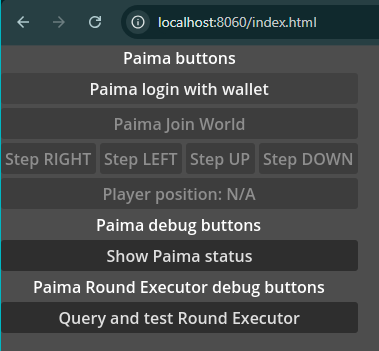

# Godot-cardano and Paima's "Open World" prototype

- [Godot-cardano and Paima's "Open World" prototype](#godot-cardano-and-paimas-open-world-prototype)
  - [Demo overview](#demo-overview)
    - [Paima addon](#paima-addon)
  - [Setting up the demo](#setting-up-the-demo)
    - [Prerequisites](#prerequisites)
    - [Add `addons`](#add-addons)
    - [Compile WASM](#compile-wasm)
    - [Generate and setup Paima template and Batcher](#generate-and-setup-paima-template-and-batcher)
    - [Export Godot demo project](#export-godot-demo-project)
  - [Running the demo](#running-the-demo)
    - [Start Paima node and required infrastructure](#start-paima-node-and-required-infrastructure)
    - [Starting frontend](#starting-frontend)
  - [Notes](#notes)
    - [Note on getting access to Paima endpoints](#note-on-getting-access-to-paima-endpoints)
    - [Calling `RoundExecutor`](#calling-roundexecutor)
    - [Note on CIP-30 callbacks](#note-on-cip-30-callbacks)
  - [CIP-30 API](#cip-30-api)
    - [Note #1](#note-1)
    - [Note #2](#note-2)
    - [Note #3: Sign data test output](#note-3-sign-data-test-output)
  - [Possible improvements](#possible-improvements)

## Demo overview

This is combination of Paima's "open-world" template and Godot project that serves for testing interactions between web-exported Godot project and Paima middleware with the wallet functionality provided by either `godot-cardano` or a light wallet in the browser.

The demo provides a very simple UI: unlike the original frontend for "open-world" game, it does not show the "world map" made from tiles, where a player can click the desired tile to move there. Instead, it shows the current player position as a `{x,y}` tuple and 4 buttons to move left, right, up or down. However, all blockchain interactions are exactly the same as they would be in the original "open-world" demo.

❗Note: It is highly recommended to have the developer's console open in the browser, as the most interesting data will be printed there during interactions. Recommended browser: Google Chrome.

To start "playing" (moving on the map) you will need either:

- An enabled light wallet installed in your browser
  - Enter wallet name into the text field above `Enable wallet` button (most common names are listed in the hint above the input field)
  - Press `Enable wallet`
- A loaded `godot-cardano` wallet, imported from a seed-phrase
  - Put the seed phrase into the text field above `Init cardano-godot` button
  - Press `Init cardano-godot`

After the wallet is enabled you should see an interface like this



From here you can start the "game" by logging in to Paima with the selected wallet and then joining the world. All blockchain interactions (joining the world and moving on the map) take some time to be propagated on chain and processed by the game node. From the player's point of view, these actions will change the UI in a short time period after the button is pressed. To be aware of what is going on under the hood, diagnostic messages will be printed to the console:

- For joining the world
  - First, the message `GD:Paima: Joining game world...` will be printed ot the browser console
  - Then, when the join action is processed, you should see `GD:Paima: join world result: ...` containing either an error or success result. If the result is a success, then movement buttons will be enabled
- For pressing the movement buttons
  - First message `GD:Paima: Submitting move...` will be printed on the browser console
  - Then, when the action is processed, you should see `GD:Paima: Moves submit result: ...` containing either an error or success result. If the action succeeded, the current position will be updated on the `Player position` UI element

The other two buttons in the UI:

- `Show Paima Status` - shows current the player stats as they are represented in the game middleware, mostly for debugging
- `Query and test Round Executor` - calls endpoint to get round executor and exercise its public API, see  [Calling `RoundExecutor` note](#calling-roundexecutor) for details

### Paima addon

At its current state this particular demo is tightly coupled with `godot-cardano` wallet framework, so even if you plan to run it with a light wallet, Rust libraries still have to be compiled and linked (see [Setting up the demo](#setting-up-the-demo)) - without them the Godot project for the demo will not compile. But the Paima addon itself is completely independent and can be used with any other Godot project and any wallet supported by Paima. Core `Paima` wrappers are introduced as the [standalone addon](../addons/@mlabs-haskell/paima-middleware/). An example of more game specific (but still wallet agnostic) middleware for the "open-world" can be found in the [demo's `game_middleware.gd`](./godot-cip-30-frontend/game_middleware.gd). Game specific middleware uses Godot Paima middleware addon as it's core. It can be used to run Godot open-world demo with any wallet supported by Pima with proper `PaimaMiddleware.LoginInfo` provided during login-in.

## Setting up the demo

### Prerequisites

- `Docker` (required to start testnet an other infra for Paima)
- `paima-engine`. Tested with `paima-engine-linux-2.3.0`.
- Rust (nightly). Tested with `cargo 1.77.1 (e52e36006 2024-03-26)`.
- `emscripten` for WASM and WEB-export. See [Godot-rust book](https://godot-rust.github.io/book/toolchain/export-web.html). Tested with `emcc (Emscripten gcc/clang-like replacement + linker emulating GNU ld) 3.1.39 (36f871819b566281d160470a1ec4515f379e9f77)`
- `node` and `npm` - used a lot by Paima setup (see [Makefile](./Makefile) and generated Paima READMEs). Tested with `node v20.12.2` and `npm 10.5.0`
- Godot. Tested with `Godot_v4.2.1-stable_linux.x86_64` (extra flag that I had to use: `--rendering-driver opengl3`). [WEB-export docs](https://docs.godotengine.org/en/stable/tutorials/export/exporting_for_web.html)
- `python` - to run web-server with required CORS headers (script taken from [godot manual `Tip` section](https://docs.godotengine.org/en/stable/tutorials/export/exporting_for_web.html#serving-the-files))

`node`, `npm` and `python` are available via `flake.nix` in the root of the current dir.

### Add `addons`

Link or copy `addons` to `paima-demo/godot-cip-30-frontend`.

Should get structure like this:

```bash
$ tree -L 2 paima-demo/godot-cip-30-frontend/addons
paima-demo/godot-cip-30-frontend/addons
└── @mlabs-haskell
    ├── cip-30-callbacks
    ├── godot-cardano
    └── paima-middleware
```

### Compile WASM

📝 The working directory should be: `libcsl_godot`.

1. `cd libcsl_godot`
2. Make sure emscripten is in PATH: `emcc --version`
3. `cargo +nightly build -Zbuild-std --target wasm32-unknown-emscripten`
4. Copy or link `libcsl_godot/target/wasm32-unknown-emscripten/debug/csl_godot.wasm` to `addons/@mlabs-haskell/godot-cardano/bin`

Optional: to prevent Godot editor from throwing a bunch of errors, the `.so` library can be compiled and added to `addons/@mlabs-haskell/godot-cardano/bin`:

   1. `cd libcsl_godot`
   2. `cargo build`
   3. (in case of Linux) Copy or link `libcsl_godot/target/debug/libcsl_godot.so` to `addons/@mlabs-haskell/godot-cardano/bin` as `libcsl_godot.linux.template_debug.x86_64.so`

If the `.so` is added, project can be run from Godot editor, but only one button to test signing will be shown in UI.

### Generate and setup Paima template and Batcher

📝 The following commands require `node + npm`.

📝 The working directory should be: `paima-demo`.

1. Copy or link to root Paima engine as `paima-engine`
2. `make init` (goes through initialization process according to the [open-world-readme](./open-world/README.md); tested in Linux,some extra flags are required for macOS, see the readme; if there is some "red" messages about vulnerabilities it should be ok
3. `make replace-env-file`. ⚠️ This command changes `.env.localhost`, generated from `./open-world/.env.example`, to properly edited version - `.env.localhost.godot`. It adds proper `BATCHER_URI`, changes `BATCHER_DB_HOST` (see generated [open-world/.env.example](./open-world/.env.example) for comparison). It is important to make this replace before the next step, or the middleware that will be built next, will miss some important settings.
4. [Optional] Adjust `RoundExecutor` query. See [Calling `RoundExecutor` note](#calling-roundexecutor).
5. `make paima-middleware` (⚠️ if you want to check out `RoundExecutor` example with this demo, make sure you finished step 4 before `make paima-middleware`)
6. `make init-batcher` - requests `sudo` to make batcher script (`./batcher/start.sh`) executable. ⚠️ `./batcher/.env.localhost` also changed according to `.env.localhost.godot`
7. `make webserver-dir` (prepares server directory fro Godot web-export and Paima middleware package)
8. `make distribute-middleware` (puts Paima middleware where it needs to be present to run the demo)

### Export Godot demo project

1. Open `paima-demo/godot-cip-30-frontend` in Godot. If `.so` library is not compiled and added to the project, editor will report a lot of errors, but web-export should work w/o issues regardless. If `.so` was compiled, you can run the project from the editor to check that library and addons work as expected - UI should show single button `Test data sign`. When button is pressed (and if the wallet seed phrase was not change) you should see *exactly* [this output](#note-3-sign-data-test-output)
2. Do web-export to `paima-demo/web-server/godot-web-export/index.html`. The project already have web-export config, but just in case make sure that in the web-export form `Extensions Support` is `On`

It should is possible to run web-exported demo already via `make godot-website` and going to `http://localhost:8060/index.html`. `Test data sign` button should work, and (unless the wallet seed phrase was changed) will output to the browser console *exactly* [this output](#note-3-sign-data-test-output).

## Running the demo

### Start Paima node and required infrastructure

📝 Following commands require Docker and `node + npm`.

📝 Working directory should be: `paima-demo`.

1. `make start-db` (will keep running in  terminal)
2. `make start-chain` (will keep running in  terminal)
3. `make deploy-contracts`
4. `make start-paima-node` (will keep running in  terminal)
5. `make start-batcher` (will keep running in  terminal)

### Starting frontend

1. `make godot-website` - will start website on `8060`. The demo can be accessed at `http://localhost:8060/index.html`

## Notes

1. Any changes to Paima middleware and related packages source code should be followed by `make paima-middleware` and `make distribute-middleware`

### Note on getting access to Paima endpoints

To make instances of `GameMiddleware` and `PaimaMiddleware` classes we need to get JS object with Paima Middleware endpoints somehow. Current approach is to add them to the `window` object via Godot web-export tools and then read from `window` in GDScript using `JavaScriptBridge`.

[Export config](./godot-cip-30-frontend/export_presets.cfg) currently adds the following JS script to the header of Godot's web-export  HTML shell

```js
<script type="module">
import endpoints from './paima/paimaMiddleware.js';
window.paima_endpoints =  endpoints;
</script>
```

Couple attempts to do the same via `JavaScriptBridge` (like evaluating JS in [cip_30_js_api.gd](../addons/@mlabs-haskell/cip-30-callbacks/cip_30_js_api.gd)) were not successful so far.

### Calling `RoundExecutor`

`open-world` template that was used for the demo does not use `RoundExecutor` from the Paima Engine when generated. For reproducibility we opt to work with freshly generated template to setup the demo, so there will be no functional query to the `RoundExecutor` out of the box. However it still would be great to see interactions with `RoundExecutor` as it is important part of th Paima Engine and it is not hard to accomplish in our case.

The only issue is that despite having a proper query in the middleware to get the `RoundExecutor`, the real executor is not created during the `open-world` demo run and it is not persisted in the database. So if we attempt to query it via middleware endpoint, the query will fail. Luckily, this query can be mocked pretty easily. We will need to adjust just couple lines in `queries.ts` file. If you followed setup steps it should be located under [{repo_root}/open-world/middleware/src/endpoints/queries.ts](./open-world/middleware/src/endpoints/queries.ts)

Search for `async function getRoundExecutor`. There you should see a query to the backend:

```js
    const query = backendQueryRoundExecutor(lobbyId, roundNumber);
    res = await fetch(query);
```

We need to replace that with a mock. Here is an example with the real query commented out:

```js
    // const query = backendQueryRoundExecutor(lobbyId, roundNumber);
    // res = await fetch(query);
    res = {
      status: 200,
      json: async () => ({block_data: {seed : roundNumber}})
    } as Response;
```

With this, when setup is finished and you run the demo, after wallet is loaded you can click `Query and test Round Executor` button. You should see a message like this

```text
43 'seed used for the round executor at the middleware'
```

and then the log with results of calls to the `RoundExecutor` JS API provided by [GDScript addon/wrapper](../addons/@mlabs-haskell/paima-middleware/paima_round_executor.gd).
  
### Note on CIP-30 callbacks

It is not quite clear at the moment how to "properly" get the returned value from GDScript callbacks wrapped with `JavaScriptBridge` (see [godotengine forum](https://forum.godotengine.org/t/getting-return-value-from-js-callback/54190/3)). The one way, is to set returned value to some object either available globally or passed as an argument to GDScript callback (see also [here](https://godotengine.org/article/godot-web-progress-report-9/)). After some experiments current solution is implemented as follows:

1. Callbacks are created by [cip_30_callbacks.gd](../addons/@mlabs-haskell/cip-30-callbacks/cip_30_callbacks.gd) and added to the `window.cardano.godot.callbacks` object
2. As first argument - `args[0]`, all these callbacks receive `resolve` callback of JS `Promise` (more on this below). For data signing callback, additionally `reject` is passed to `args[1]`
3. When GDScript callback finishes work an need to return result, it calls `resolve` callback passed as `args[0]` using the following code: `promise_callback.call("call", promise_callback.this, value_to_return)`
4. [cip_30_js_api.gd](../addons/@mlabs-haskell/cip-30-callbacks/cip_30_js_api.gd) has a single function that evaluates raw Javascript snippet,  which performs the following:
   1. Adds a CIP-30 compliant `window.cardano.godot` object with a Promise based API
   2. Adds a (non-standard) `window.cardano.godot.callbacks` object. This is an implementation detail.
   3. Adds CIP-30 API functions to `window.cardano.godot`. To enable communication with wallet, callbacks from `window.cardano.godot.callbacks` are wrapped here in such a way that:
      1. `Promise` is created via `Promise.withResolvers()`
      2. `resolve` is passed to GDScript callback (from `window.cardano.godot.callbacks`) as first argument (will become `args[0]`). For data signing `reject` passed as well as `args[1]`
      3. `Promise` instance is returned to the caller  

As a result of all these manipulations, when a GDScript callback executes `promise_callback.call("call", promise_callback.this, value_to_return)`, the `Promise` will be resolved and the returned value can be obtained on JS side. The JS code execution function from [cip_30_js_api.gd](../addons/@mlabs-haskell/cip-30-callbacks/cip_30_js_api.gd) is invoked by [cip_30_callbacks.gd](../addons/@mlabs-haskell/cip-30-callbacks/cip_30_callbacks.gd) right before setting callbacks to the `window.cardano.godot.callbacks`. After executing JS code and adding callbacks, the user can get a CIP-30 compliant API when calling `enable()` on the `window.cardano.godot` object in the browser.

## CIP-30 API

Currently implemented:

- `enable()`
- `getUsedAddresses()` (always returns array of single element)
- `getUnusedAddresses()` (always returns empty array)
- `signData()`

⚠️ Not implemented:

- CIP-30 compliant errors

### Note #1

Currently, CIP-30 API initialization is split between [cip_30_callbacks.gd](../addons/@mlabs-haskell/cip-30-callbacks/cip_30_callbacks.gd) and [cip_30_js_api.gd](../addons/@mlabs-haskell/cip-30-callbacks/cip_30_js_api.gd). It should be possible to implement JS code evaluation from `cip_30_js_api.gd` as GDScript code also, but that most certainly will require a lot of wrapping using `JavaScriptBridge` and associated debugging.

### Note #2

Definition of  `JavaScriptBridge` callbacks should be done with care and exactly matching the examples from the tutorial, as things tend to break silently here.

### Note #3: Sign data test output

Reference output produced during test data signing.

Seed phrase:

```text
camp fly lazy street predict cousin pen science during nut hammer pool palace play vague divide tower option relax need clinic chapter common coast
```

Test string: `godot-test`

String hex of `godot-test` that will be signed (required by CIP-30 API): `676f646f742d74657374`

Sign data output:

```text
Signing known test data - hex of godot-test :  676f646f742d74657374
Test sig address hex:  01ed172afa5d54ba09671a4adfeb506d6da4efb0aafbea340dc7988bd4f14d9c745eafc9ff4f3f51a518d7f245d02ef7b7902c299a5cdd2c1a
Test sig address bech32:  addr1q8k3w2h6t42t5zt8rf9dl66sd4k6fmas4ta75dqdc7vgh483fkw8gh40e8l5706355vd0uj96qh00dus9s5e5hxa9sdqhrw0uy
Test sig COSE key:  a4010103272006215820f37625a801a522d7ef31ae93d34bfe77e64102fbf7f48dbb0f00b2f94bccc064
Test sig COSE sig1:  845846a201276761646472657373583901ed172afa5d54ba09671a4adfeb506d6da4efb0aafbea340dc7988bd4f14d9c745eafc9ff4f3f51a518d7f245d02ef7b7902c299a5cdd2c1aa166686173686564f44a676f646f742d7465737458404c42599cfe5d9da0dc38b0e5c8b54220dc7109410b3c6943874c36f6522009b4b33fbe7b97adfa5f4dccd550ff8fa5441bb9b07f17af3d87fae1fadbdb714408
```

## Possible improvements

- Figure out what is required to rename `csl_godot.wasm` to match other extensions names. Currently if WASM filename does not match `name` in `config.toml`, WASM will fail to load with `file not found`. Maybe changing name in custom HTML shell `GODOT_CONFIG.gdextensionLibs` is sufficient
- CIP-30 compliant errors
- Reduce the [spread of CIP-30 API initialization across multiple source files](#note-1)
- Improve the way to get access to Paima middleware endpoints. Currently they are added to the global state in `window` (see [Note on getting access to Paima endpoints](#note-on-getting-access-to-paima-endpoints))
  
